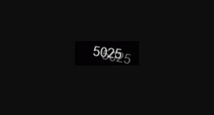
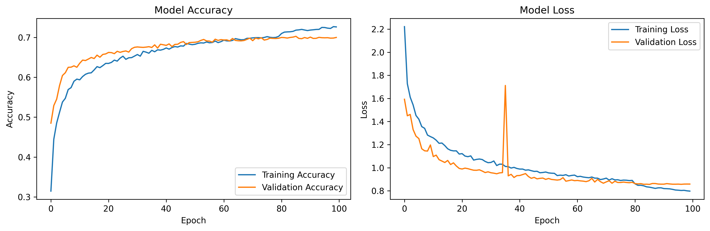

# Captcha OCR Trainer

This project is a simple proof-of-concept for training an OCR model to recognize numeric CAPTCHAs using TensorFlow/Keras.

- **Dataset**: ~500 manually labeled captcha images  
- **Goal**: Recognize 4-digit captchas  
- **Accuracy**: ~70% on validation (with small dataset)  
- **Limitations**: Accuracy can be improved by collecting and labeling more data
- **Next updates**: Making the accuracy bigger

## Test Captcha Examples


## Learning Curve



## How to run
```bash
pip install -r requirements.txt
python train.py
